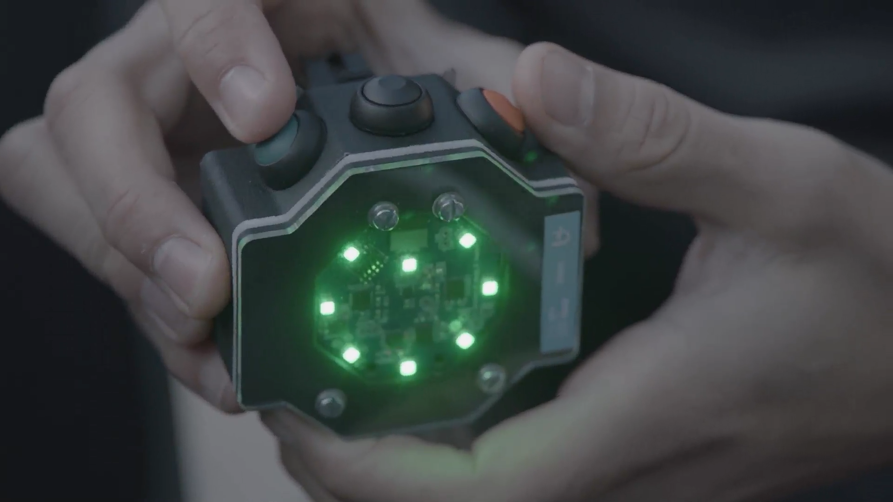

# Team Scheire BicycleLight voor Carmen

Deze repository bevat de code en hardware schemas van twee deelprojecten:

1. CME (Het fietslicht en alle aanpassingen voor Carmen haar fiets)
2. SmartLight (het slimme fietslicht waarmee je een positive of negatieve fietservaring kan meedelen)

## 1. CME

In deze folder staat de finale versie die een arduino mini gebruikt (v1.0). Zowel hardware schemas en software kan je er terug vinden.

## 2. SmartLight

In [deze folder](SmartLight) kan je volgende terug vinden:

- Hardware schema of het device en de 'bill of materials'
- Het ontwerp van de behuizing
- De firmware van het toestel
- De code voor de smartphone app (zowel android als iphone) dat de BLE (Bluetooth Low Energy) data van het toestel doorstuurt naar de backend.
