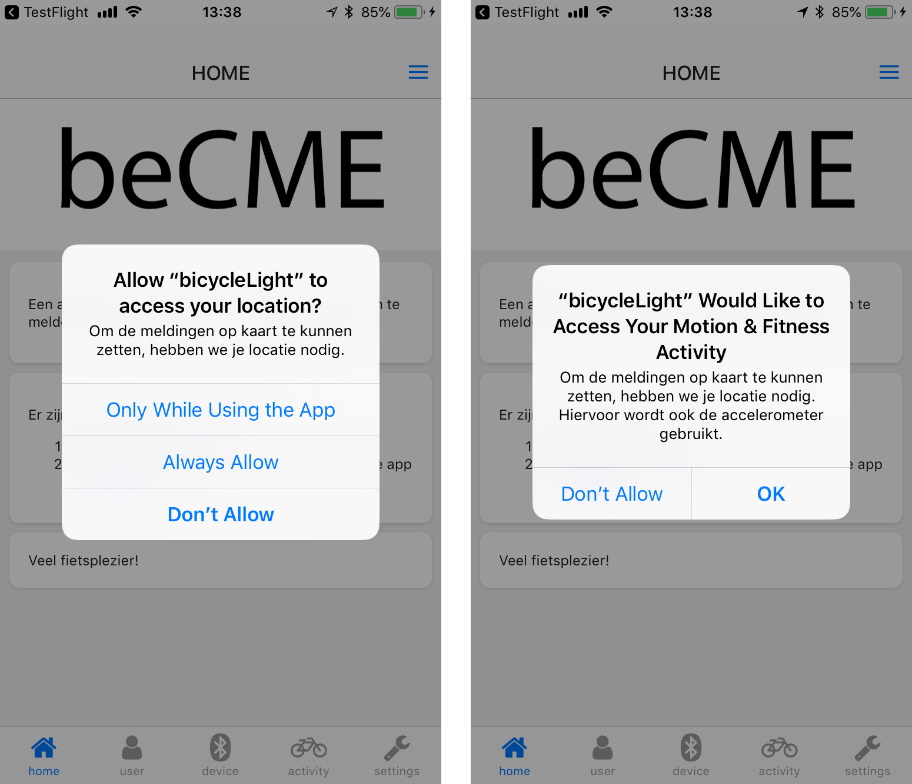
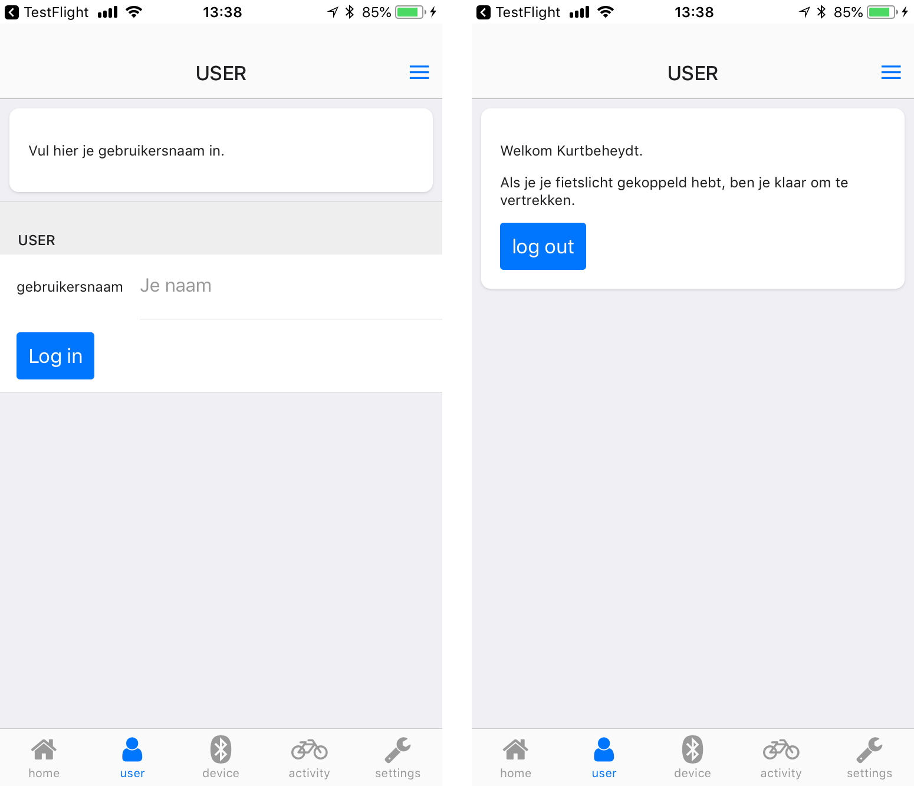
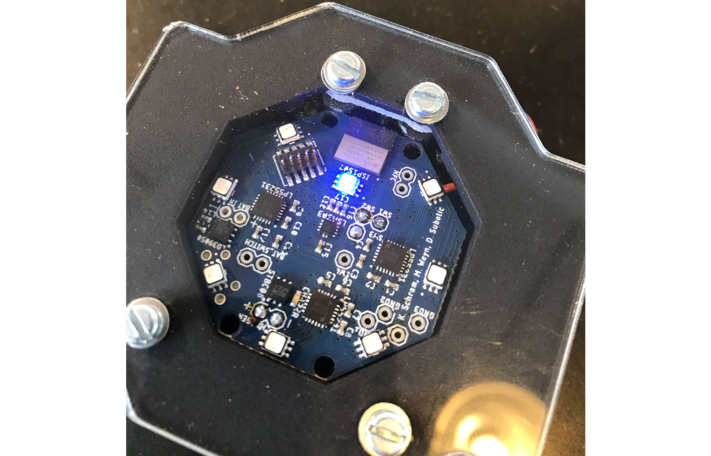
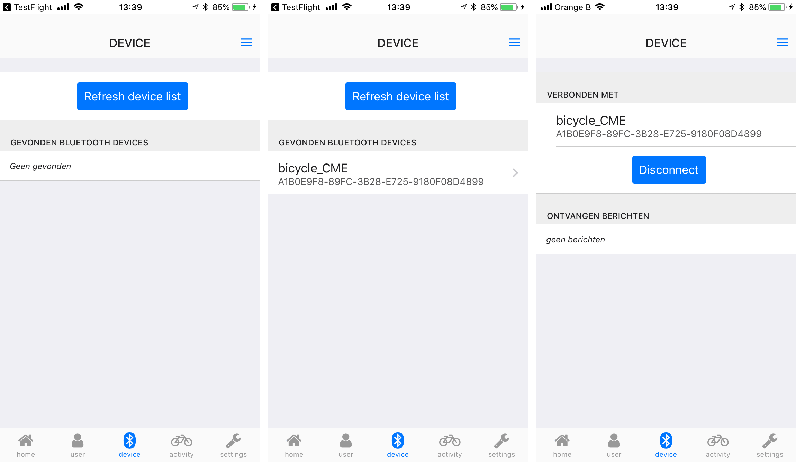
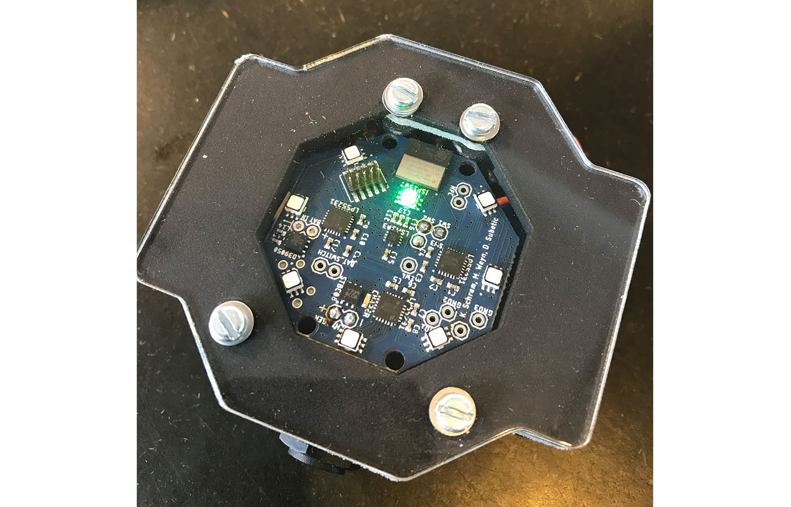

# Smartphone app voor het slimme fietslicht
## Installatie

[Cordova](http://cordova.apache.org) is een framework om via html en javascript een native app te maken voor Android en iOS. Ideaal dus om een prototype te maken.

Om cordova te installeren volg je best [deze handleiding](https://cordova.apache.org/docs/en/latest/guide/cli/#installing-the-cordova-cli).

Als je de code van deze app bv via git hebt gedownload, ga je in een terminal naar de folder van de app en initialiseer je de plugins via:

`npm init`

Om een platform toe te voegen (iOS of Android) voer je het volgende uit:

`cordova platform add ios`

of

`cordova platform add android`

## Compileren

Om het te kunnen draaien heb je voor Android de SDK nodig en voor iOS xcode. Hiervoor heb je een extra installatie en configuratie nodig die goed uitgelegd staat op deze pagina's:

- [handleiding voor Android](https://cordova.apache.org/docs/en/latest/guide/platforms/android/index.html)
- [handleiding voor iOS](https://cordova.apache.org/docs/en/latest/guide/platforms/ios/index.html)

## Handleiding van de app

_De screenshots zijn voor de iOS versie, op android ziet het er iets anders uit, maar zijn de stappen zeker vergelijkbaar._

### Eerste keer opstarten
De eerste keer je de app opstart, ga je twee extra schermen krijgen met vragen voor extra toegang tot je locatievoorzieningen en activiteit.
Aangezien de app je locatie wil blijven updaten, ook al zit je telefoon bv in je broekzak en draait de app niet, heeft de app extra toegang nodig hiervoor. 

Kies voor locatie ‘Always allow’ of ‘altijd toestaan’
Kies voor activiteit ‘Ok’

### Jezelf kenbaar maken
Je moet jezelf nog kenbaar maken door je naam in te vullen op de pagina ‘user’. Vul je voornaam en familienaam in (zonder spatie) en kies ‘log in’. 

### Connectie maken met je fietslamp
De laatste stap is verbinding maken met je fietslamp. 

Zet je fietslamp aan door op de zwarte knop bovenaan in het midden te klikken. Er knippert nu een blauw controlelampje in het midden van het licht.

Ga in de app naar de pagina ‘device’ en kies ‘Refresh device list’.
Het licht zou nu moeten verschijnen in de lijst van gevonden bluetooth devices. klik op de naam van je fietslamp.

Je hebt nu de app verbonden met je fietslamp.
Je fietslamp zelf geeft nu een groen lampje dat knippert, dit wil zeggen dat het verbonden is met je telefoon.

### Klaar en fietsen maar
Je locatie wordt nu bijgehouden en meldingen doorgestuurd.

Wil je stoppen met fietsen, dan kan je drie dingen doen om ervoor te zorgen dat je locatie niet meer bijgehouden wordt:

- ofwel zorg je dat je niet meer in de buurt van je fietslamp bent.
- ofwel kies in de app op de pagina ‘device’ de optie ‘disconnect’
- ofwel sluit je de app helemaal af: dubbelklik op de homebutton en dan de app wegswipen. (Mocht je dit niet kennen, deze procedure staat [hier uitgelegd](https://www.imore.com/how-force-quit-apps-iphone-ipad)) 

Wil je daarna terug beginnen fietsen, open de app, check of je licht nog aan staat (knipperende led), zet je licht opnieuw aan (zwarte knop), kijk op de pagina devices of je nog verbonden bent, zoniet klik op ‘refresh device list’ en je lamp zal terug verbinden.
>>>>>>> d8745afd7f5b38c460903eb3af9ccc9a39e79447
