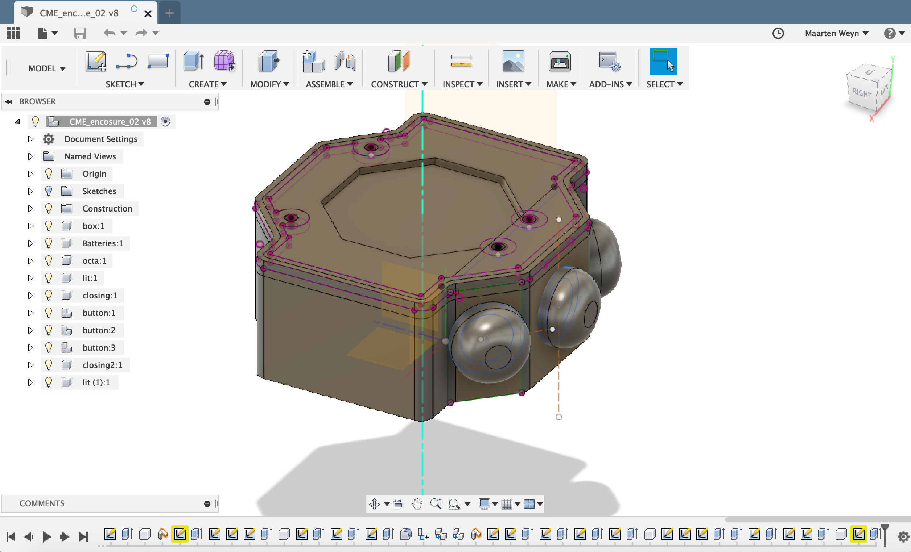

## Behuizing

De behuizing is ontwikkeld in [Fusion 360](https://www.autodesk.com/products/fusion-360/overview).

De [CME-enclosure-02-v7.f3d](CME_enclosure_02-v7.f3d) is een export of het project, de step en stl files kunnen direct gebruikt worden om te laten printen.
