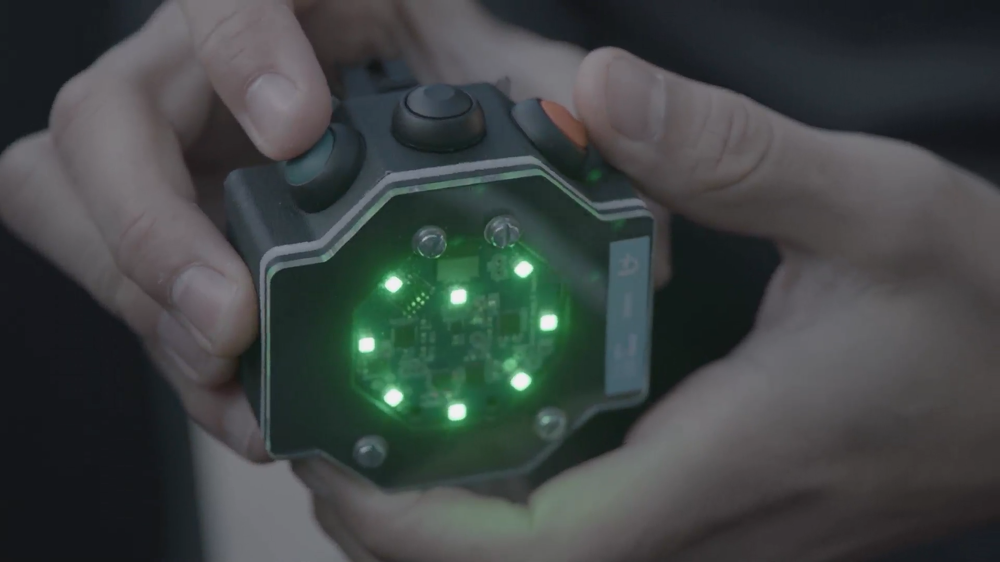

## Behuizing

De behuzing is ontwikkeld in [Fusion 360](https://www.autodesk.com/products/fusion-360/overview).

De [CME_encosure_02 v7.f3d](CME_encosure_02 v7.f3d) is een export of het project, de step en stl files kunnen direct gebruikt worden om te laten printen.
